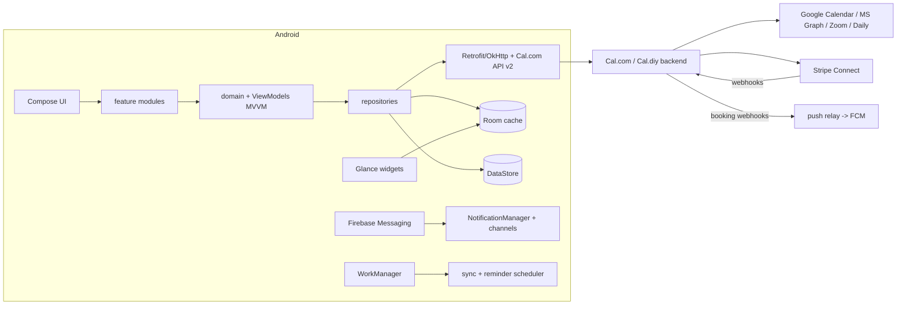

# Android "Book-A-Meeting" App — Design Plan

Research grounded in Calendly's mobile-app/help pages, Calendly's feature/pricing pages, and Cal.com's API v2 docs + README. Plan follows.

## 1. Feature benchmark (what we're matching)

**Calendly** (from help center + mobile app overview): bottom-nav app — Home (today's meetings, recaps, attendee intel, notification center), Scheduling (event types, single-use links, real-time booking, one-off meetings), Meetings (timeline/week views, cancel/reschedule, no-show marking, notes), Contacts (view/create/book-with). Availability: preferred hours, buffers before/after, per-event day/week/month meeting limits, free/busy priority rules, start-time increments, timezone locking, min-booking-notice. Event types: 1:1, Group, Collective, Round Robin. Payments: Stripe/PayPal collection on Standard+ plans, service *packages*, invoices. Reminders/sequences, routing forms, 100+ integrations, auto Zoom/Meet link per booking, website embeds, Notetaker (AI recaps), Callie (AI scheduling).

**Cal.com** (API v2 docs, repo): same scheduling core plus API-first surface — `bookings`, `event-types`, `schedules`, `availability`, `slots`, `webhooks` (booking created/cancelled/rescheduled, meeting start/end), OAuth clients (60-min access / 1-year refresh tokens), teams/orgs/attributes endpoints, routing forms with attribute-based rules + analytics, workflows (email/SMS reminders), app-store integrations (Google Calendar, Office365, Zoom, Daily, HubSpot, Pipedrive, Zoho, Stripe), whitelabel embeddable "Atoms" booking UI. **Notable:** Cal.com shipped their own iOS/Android app in <3 weeks using Expo — one codebase with their browser extension. EE-only: Teams, Orgs, Insights, Workflows, SSO/SAML (stripped in MIT "Cal.diy" fork).

## 2. Two decisions that shape everything

**Backend: don't rebuild the scheduler. Build against Cal.com API v2** (hosted Cal.com, or self-hosted Cal.diy if we must own data). Slot computation, calendar busy/free, round-robin, buffers, limits, webhooks, reminders are a solved, battle-tested engine — the value-add is the Android experience. Fallback if a bespoke backend is mandated: mirror Cal.com's schema (`EventType`, `Booking`, `Schedule`, `Availability`, `Credential`) — it's proven.

**Client: native Kotlin + Jetpack Compose, not Expo.** The brief demands widgets + notifications as first-class citizens: Glance home-screen widgets, exact-alarm reminders, App Links, QS tiles, CalendarContract writes all need native code anyway — in RN each becomes a hand-rolled native module. Native keeps the reminder/widget path reliable under Doze OEM pain.

## 3. Architecture

Modules (`:app`, `:core:*`, `:feature:auth`, `:feature:schedule`, `:feature:bookings`, `:feature:availability`, `:feature:payments`, `:feature:contacts`, `:feature:notifications`, `:feature:widgets`). Hilt DI, single-Activity + Navigation-Compose, offline-first Room cache (single source of truth; UI renders cache, repo reconciles with API), Kotlin coroutines/Flow throughout. minSdk 26, target latest.

## 4. Auth

- **Sign-in:** OAuth2 + PKCE against our backend (Cal.com's NextAuth-compatible `/api/auth` or own IdP), via Chrome Custom Tabs (`androidx.credentials`/App Links). Providers: Google, Microsoft (both double as calendar connectors), email magic-link OTP. Apple/SSO deferred (Play parity fine without).
- **Token handling:** access (60-min) / refresh (1-year) — Cal.com's rotation model, so design for **rotate-on-refresh with atomic persist** (Android Keystore-backed storage, e.g. `EncryptedFile`/Keystore-wrapped prefs; never plain DataStore for refresh tokens). OkAuthenticator-style token-refresh interceptor on 401 → refresh → replay; single-flight refresh.
- **App lock:** BiometricPrompt (`androidx.biometric`) gated optional; auto-lock on background >5 min. Session revoke via device-bound FCM token registration.
- **Roles:** `OWNER` (host, books/paid) vs `INVITEE` (opens shared link — app can view booking page without account; Calendly behavior).

## 5. Views (mirrors Calendly's proven IA)

Bottom nav: **Today · Bookings · Contacts · Settings** + FAB.

| Screen | Key content / actions |
|---|---|
| Today | Date-scoped meeting list w/ countdown, join button (video URI), attendee cards, per-event type color, "no time today" empty state with share-link CTA |
| Booking detail | Invitee list, host(s), location, ICS payload, cancel/reschedule (policy-aware), mark no-show, notes, payment status, reminder chips |
| Event types | Cards w/ duration/price badges; editor wizard: name→duration→location(Zoom/Meet/phone/address)→description→availability link→buffers/limits/increment→custom questions (form-builder)→payment toggle |
| Share | Booking link + QR, single-use link creation (Calendly "Scheduling" tab), share sheet w/ default message, copy, embed on profile |
| Availability editor | Weekly hours grid (drag to set), date-specific overrides (busy/free/away), timezone, connection toggle (hide events w/ private visibility) — Room-backed, debounce PATCH |
| Meetings timeline | Day/week segmented toggle (Calendly's two views), infinite scroll past/upcoming, filters by event type |
| Contacts | List + detail (activity history = past bookings), book-directly flow, create/edit, CSV import |
| Booking preview (invitee) | Deep-link target: event page, timezone-aware slot grid (server-computed `slots`), duration/date, form, pay step → confirmation + add-to-calendar |
| Reschedule flow | "Proposed new time" negotiation mode (Cal.com supports; Calendly invitee-initiated) |
| Payments (host) | Stripe Connect onboarding (WebView), balance/payout list, invoices/packages management |
| Settings | Notifications matrix (channels), default share msg, calendars list (connect/disconnect/sync interval), appearance, security (biometric, sessions) |

Timezone handling: every slot request carries zone + offset (Cal.com API pattern); UI shows invitee-local, stores UTC.

## 6. Payments — the Play-policy trap

Three flows, two rails; getting this wrong is a $200k/settlement-class mistake:

1. **Booking fees (invitee pays host)** — real-world service, *exempt* from Play Billing (Google Play's physical-services/real-world-goods exemption applies to appointment payments for services performed offline). Use **Stripe**: backend creates PaymentIntent + `stripeAccountId` (Connect destination charge on host), client uses **Stripe Android PaymentSheet** (cards, Google Pay via wallet integration). Funds route host↔Stripe; platform takes application fee. PayPal parity via backend (Calendly's Stripe+PayPal pair) deferred.
2. **App subscriptions (free/host "Pro" plan)** — digital benefit consumed in-app → **must** use Play Billing Library v7+ (one-time purchase for "Business", subs for team features), backend validates purchases via RTDN + subscriptionsv2 API.
3. **Prepaid meeting packages + invoices** (Calendly feature): server-side ledger — Stripe invoicing, `packageBalance` decremented per redemption; app shows balance and usage.

Rules baked in: PaymentIntent idempotency keys = `bookingId`; booking stays `PENDING_PAYMENT` until Stripe webhook `payment_intent.succeeded` (client never confirms paid state itself); refund mirrors cancellation policy (cancel window → auto-refund or keep-as-credit); no card data ever touches the app beyond PaymentSheet.

## 7. Notifications

Channels (`bookings`, `reminders`, `followups`, `payments`, `mentions`), each with own importance/icon.

- **Real-time events** (booking created/cancelled/rescheduled, payment): backend webhooks → push relay → FCM **data messages** (silent) → app updates Room + widget, posts user-visible notif with actions: **Join**, **View**, **Reschedule**, **Cancel**, **No-show**.
- **Pre-meeting reminders** (10 min / 1 h / day-before, per-event-type matrix like Calendly workflows): schedule **locally** with `AlarmManager.setExactAndAllowWhileIdle` + `RECEIVE_BOOT_COMPLETED` re-arm + WorkManager periodic reconciler (every 6h) that diffs upcoming bookings and re-enqueues. Android 14+: request `SCHEDULE_EXACT_ALARM` with rationale UI; degrade gracefully to inexact if denied. Fallback push-only reminders (Firebase `collapse_key`, `event_time`) if exact-alarm path dies under OEM battery killers — test on Xiaomi/Samsung.
- **Invitee-side:** confirmation ICS attached with VALARM so the meeting reminder lands in their *native* calendar, not just our app.
- Notification center inbox screen (Calendly's Home→notifications), read-state synced via API.
- Foreground service for "meeting starting soon" ongoing notif (optional), plus DND-aware quiet hours.

## 8. Widgets (Glance)

| Widget | Content | Interactions |
|---|---|---|
| **Up Next** (2x2 / 4x2) | Next meeting: title, time-left, attendee initials, join link | tap→detail, tap join, refresh; Live updates: WorkManager 15-min + FCM-triggered `updateAllWidgets` |
| **Share Link** (4x2) | Event-type chips + QR | tap chip → `ACTION_SEND` pre-filled booking link (share sheet, no app open) |
| **Availability** (2x2) | Today's free windows count, next 3 slots | tap → Availability editor; toggle "Pause bookings" (OOO) via one-shot API call — most-requested Calendly mobile pain point |
| **QS tile** (not widget but same idea) | Pause/Resume bookings tile | `TileService`, no auth-interstitial needed w/ token refresh |
| **App shortcuts** | long-press: Share link, New event type, Today | `ShortcutManager` dynamic pinned |

Widgets read Room directly (single writer), `@WorkRequest` prefetch; `GlanceAppWidget` + `ReceiveContent`/`ActionCallback` for the toggle. Glance (not RemoteViews) — same Compose mental model.

## 9. Data model (client cache, Room)

`users`, `event_types` (+`custom_inputs`, `buffers`, `limits`, `payment` FK), `bookings` (+`attendees`, `status`, `payment_status`, `uid`, `recurring_id`), `slots_cache`, `schedules`, `availability_overrides`, `credentials` (calendar/video links), `contacts` (+`booking_activity` view), `notifications` (+read-state), `payment_records`, `outbox` (pending mutations w/ idempotency keys for offline create/patch). All timestamps UTC epoch millis; `BookingStatus`: `ACCEPTED | PENDING | CANCELLED | RESCHEDULE_PENDING | NO_SHOW`.

## 10. Security & reliability

TLS + OkHttp cert pinning (`network_security_config`), Keystore-wrapped tokens, R8 + Stripe proxy fields scrubbed, Play Integrity attestation on booking-create (anti-slot-scraping, the real abuse vector for paid bookings), deep-link verification via `assetlinks.json`, per-user rate-limit awareness (Cal.com 120 req/min → batch + ETag caching), crash-free target via Firebase Crashlytics + ANR (StrictMode in debug).

## 11. Roadmap

- **P0 (MVP, ~6-8 wk):** auth+PKCE, calendar connect, single event type, slot grid booking, upcoming meetings, FCM push + basic reminders, share link, Up Next widget.
- **P1:** availability editor w/ buffers/limits, reschedule/cancel flows, video links, Stripe booking fees + Connect onboarding, Play Billing subscription, notification center, Share Link + Availability widgets, QS tile.
- **P2:** group/collective/round-robin, single-use links, contacts, packages/invoices, workflow-style multi-channel reminders, timezone lock, ICS/App Links invitee-only mode.
- **P3:** routing forms, team admin, insights-lite, AI scheduling assistant, Wear OS complication.

## 12. Risks worth naming early

1. **Exact alarms on Android 14+** — the single biggest reminder-reliability cliff; ship dual-path (local exact + server push).
2. **Play billing classification** — get legal ruling on booking-fee vs subscription split before building payments.
3. **OAuth quota/verified-app review** for Google Calendar/MS Graph (unverified app = "unverified app" warning screen for all invitees) — start early.
4. **Cal.com EE boundary** — teams/workflows/insights are paid-EE or absent in MIT fork; decide self-host-Cal.diy (no team features) vs Cal.com cloud license before P2.

Choice point: **Cal.com cloud vs self-hosted backend** — it drives P2 team features, data-ownership claims, and payment-flow control. The client design above is identical either way.

## Sources

- Calendly mobile app overview — https://calendly.com/help/calendly-mobile-app-overview
- Calendly scheduling features — https://calendly.com/scheduling
- Calendly features/pricing breakdown — https://aherisystems.com/tools/calendly/features/
- Cal.com API v2 introduction — https://cal.com/docs/api-reference/v2/introduction
- Cal.com routing / webhooks docs — https://cal.com/routing , https://cal.com/docs/developing/guides/automation/webhooks
- Cal.com repo (Cal.diy MIT fork) — https://github.com/calcom/cal.diy
- How Cal.com shipped the mobile app on Expo — https://cal.com/blog/how-cal.com-shipped-an-ios-android-app-using-expo-and-chrome-firefox-using-wxt-in-one-codebase
