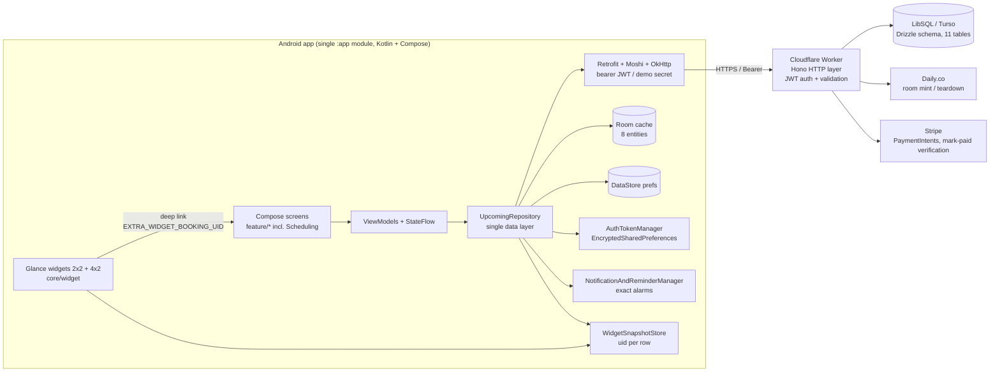

# Upcoming Android — As-Built Architecture

**Status:** reflects the implementation as of August 30, 2026 — `main` with the stacked PRs through **Phase 8** merged (Android #1–#5, upcoming-db #13–#17). Phase 8 added the Scheduling share surface (booking link + QR + single-use links) and the Glance home-screen widgets with deep links. Backend since updated through upcoming-db **#19–#22**: event-type create/update/delete endpoints (owner-scoped), `src/`+`scripts/` layout, official API domain **`api.getupcoming.app`**, rate limiting, and FCM push (see `Docs/api-contract.md` §4 in the backend repo for the authoritative HTTP surface).
**Companion documents:** `docs/comparison-results.md` (implemented vs the scoped Cal.com-Android plan), `docs/api-contract.md` (authoritative backend contract), `docs/upcoming-design-system.md` (design tokens).

---

## 1. System overview



The official share domain is **`https://getupcoming.app`** — personal booking links and single-use links (`?lid={token}`) are built on it server-side (`worker.ts:756`); the in-app deep-link path from widgets is internal (see §4.4).

Design decisions that shape everything:

- **The Worker is the backend.** Slot math, conflict detection, idempotency, Daily rooms, and payment verification live server-side (`upcoming-db` repo). The client treats it as the source of truth and never re-implements write-side invariants.
- **Room is a read cache, not the source of truth.** Network-first refresh into Room; UI Flows read Room so the app renders instantly and survives offline (reads only).
- **Writes are remote-first and fail loudly** — no outbox; local-only writes exist solely for the demo persona.
- **Manual DI at one composition root** (`MainActivity.kt:36-50`): DB → AuthTokenManager → Retrofit API → repositories. No Hilt.

---

## 2. Client architecture

### 2.1 Package layout (single `:app` module)

```
com.example
├── MainActivity                  # composition root + splash auth gate + widget deep link (singleTask)
├── navigation/UpcomingNavigation # NavHost, bottom-nav (4 tabs), shared VM factory
├── ui/theme                      # UpcomingTheme (design-system tokens)
├── core/
│   ├── auth/                     # AuthRepository, AuthTokenManager, AuthState
│   ├── database/                 # Room DB, DAOs, entities (8)
│   ├── designsystem/             # Tokens.kt, shared components
│   ├── engine/                   # SchedulingEngine, NotificationAndReminderManager
│   ├── model/                    # domain models (User, EventType, Booking, OfferedSlot…)
│   ├── network/                  # Retrofit interface, DTOs, apiCall, ApiException
│   ├── prefs/                    # DataStore notification preferences
│   ├── repository/               # UpcomingRepository (single ~1.2k-line data layer)
│   ├── util/                     # QrCode.kt (ZXing QR helper)
│   └── widget/                   # UpcomingWidgets.kt (2x2 + 4x2), WidgetSnapshotStore.kt
└── feature/
    ├── auth, availability, bookingflow, bookings, dashboard,
    ├── eventtypes, legal, notifications, permissions, scheduling, settings
```

### 2.2 Navigation

Single-Activity, Navigation-Compose. Routes (`UpcomingNavigation.kt:48-61`): `dashboard`, `event_types`, `event_type_editor`, `availability`, `bookings`, `booking_detail/{uid}`, `book` (4-step flow), `scheduling` (Phase 8 share surface), `settings`, `settings/notifications`, `settings/permissions`, `auth`, `legal/terms`, `legal/privacy`. The splash screen holds until the auth gate resolves (`MainActivity.kt:31-56`); `AuthState` (Loading/LoggedOut/Demo/LoggedIn, `AuthTokenManager.kt:16-21`) picks the start destination. A single `ViewModelProvider.Factory` constructs all ViewModels with repository access (`UpcomingNavigation.kt:389`).

Bottom nav has **four tabs** (Events / Bookings / Availability / Scheduling); Settings opens via the top-bar **avatar** and the **bell** routes only to Notifications (`UpcomingNavigation.kt:121-133`).

### 2.3 Identity & demo isolation

- `primaryUserId: MutableStateFlow<Long>` starts at the local seed id and re-points to the `/me` user when `refreshMe()` lands; all "primary user" consumers use `flatMapLatest` on it (`UpcomingRepository.kt:54, 431-436`).
- **Demo mode** (`isDemoSession()`, `:49`) gates all seeding. A real session purges any demo rows on establishment (`onSessionEstablished()`, `:127-137`) so the demo persona can never leak into a signed-in account.
- The Room `users` table mirrors the server schema (including `metadata` JSON), so no migration was needed when settings moved server-side.

### 2.4 Sync strategy

| Data | Direction | Behavior |
|---|---|---|
| Event types | server → Room | **Full-replace** (`refreshEventTypes()`, `:80-104`): upserts remote, then deletes local ids absent remotely — prevents stale local ids (e.g. old seeds 1–4 vs cloud 38–41) from reaching the server |
| Bookings | server → Room | Upsert by `uid` (`refreshBookings()`/`upsertBookingRow()`, `:107-119, 373-397`) |
| Profile/schedule | bidirectional | `GET/PATCH /me`, `PATCH /me/schedule` (server keeps `users.timezone` + `schedules.timezone` in lockstep), mirrored into Room |
| Reminder offsets | bidirectional | DataStore (instant, device) + `users.metadata.prefs` (account-following), `:288-311` |
| Availability reads | server-first | `GET /availability`; **Room fallback + local `SchedulingEngine`** only when the API is unreachable — a definitive server error (400/404) is rethrown, never degraded (`:535-605`) |
| Network errors | — | `apiCall {}` translates HttpException/IOException into `ApiException.SlotConflict/NotFound/Validation/Network/Server` **in-coroutine**; `isNetworkError()` is the single "fall back to cache" predicate (`UpcomingApi.kt:138-159`) |

### 2.5 Auth flow

```
signup/login → AuthResponse { accessToken, refreshToken, user }
  → save() into EncryptedSharedPreferences (AES-256-GCM master key)   AuthTokenManager.kt:28-56
  → OkHttp interceptor attaches "Bearer <access|demoSecret>"          UpcomingApi.kt:111-118
  → on 401: Authenticator single-flight refresh, rotate + persist, replay once  :97-106
  → logout: best-effort POST /auth/logout (server revokes refresh), local clear  AuthRepository.kt:71-79
```

Server side (`upcoming-db/auth.ts`): scrypt password hashing, HS256 access tokens (1h TTL), opaque refresh tokens stored **hashed** (30d TTL), open routes limited to `auth/*`.

---

## 3. Backend (`upcoming-db` + Cloudflare Worker)

- **Stack:** Drizzle ORM over LibSQL/Turso; Hono Worker deployed at **`https://api.getupcoming.app`** (Workers custom domain; the `*.workers.dev` hostname is secondary); `wrangler` secrets hold `API_SECRET`, `TURSO_*`, `DAILY_API_KEY`, `STRIPE_SECRET_KEY`, `JWT_SECRET`, `FCM_SERVICE_ACCOUNT`, `TOKEN_ENCRYPTION_KEY` (credentials encrypted AES-256-GCM envelope). Rate limiting: Cloudflare WAF rule (15 req/10s per IP per colo) + per-endpoint Worker tiers (`/auth/*` 10/min, `/availability` 50/min, `POST /bookings*` and `/payments/*` 20/min, default 100/min; 429 + `Retry-After`).
- **Push (FCM, backend #22):** token registered via `PATCH /me` → `metadata.fcmToken`; lifecycle pushes (booking created/cancelled/paid) fire to the booking's host via `waitUntil`; a `*/15` cron + admin `POST /push-reminders` sweeps reminder offsets from `metadata.prefs.reminderOffsets`. Payload contract: `Docs/api-contract.md` §4.4. Push is soft-fail end to end.
- **Schema (11 tables):** `users`, `schedules` (1/user), `availability` (recurring `day_of_week` or `date_override` rules), `event_types`, `event_type_hosts` (uniform host model — every type has host rows), `bookings` (+ snapshot buffers, `idempotency_key` UNIQUE, chosen-location JSON, `paid`, `payment_intent_id`), `attendees`, `host_occupancy_ticks` (1 row/host/occupied UTC-minute; the UNIQUE index is the concurrency backstop), `booking_hosts` (collective), `credentials`, and `single_use_links` (Phase 8 — per-event-type one-time tokens with revoke/used/expiry columns). Full contract: `docs/api-contract.md`.
- **Route table** (`worker.ts`):

| Route | Method | Purpose |
|---|---|---|
| `/health` | GET | liveness (`worker.ts:145`) |
| `/auth/signup` `/auth/login` `/auth/refresh` `/auth/logout` | POST | JWT pair lifecycle (`:203-286`) |
| `/event-types` | GET | list (`:310`) |
| `/event-types` | POST | create, owner = JWT user (backend #19) |
| `/event-types/:id` | PATCH/DELETE | update / soft-delete, owner-scoped (backend #19) |
| `/me`, `/me/schedule` | GET/PATCH | profile, metadata, timezone lockstep (`:415-490`) |
| `/me/credentials[/:type]` | GET/PUT/DELETE | BYO keys, masked hints only (`:562-624`) |
| `/bookings[/:uid]` | GET | list/detail (`:641-672`) |
| `/availability` | GET | multi-host slot search (`:699`) |
| `/bookings` | POST | create (idempotent, atomic; optional `singleUseToken` burn) (`:732`) |
| `/bookings/cancel` | POST | cancel + tick/room pruning in one tx (`:742`) |
| `/single-use-links[/:id]` | POST/GET/DELETE | owner-scoped single-use link create/list/revoke; `getupcoming.app` URLs (`:799-863`) |
| `/payments/create-intent` `/payments/mark-paid` | POST | Stripe PI per event-type price; `paid` flips only after PI verification (`:890-950`) |
| `/push-reminders` | POST | admin-only manual reminder-sweep trigger (backend #22) |

- **Error contract:** `mapErrorToHttp` — 409 slot conflicts, 404 unknown booking, 400 validation, generic 500; the client's `apiCall` mirrors exactly these (`UpcomingApi.kt:147-152`).

---

## 4. Key flows

### 4.1 Availability + booking

1. `InviteeBookingViewModel` requests slots for a date range → `UpcomingRepository.computeAvailableSlots()` (`:535-605`): `GET /availability` (server owns DST, min-notice, slot grid, host routing) → slots rendered in the invitee's timezone.
2. **Create** (`createBooking()`, `:607-695`): local idempotency replay first (cache hit works offline), then `POST /bookings` with `idempotencyKey = UUID`. The handler enforces the slot grid, working hours for every host, min-notice, and buffer-expanded conflicts atomically; mints the Daily room when the chosen location is `integrations:daily`. Result stored into Room (+ attendee row).
3. **Cancel** (`cancelBooking()`, `:811-851`): remote-first (handler prunes ticks + deletes minted rooms in the same transaction); local reconcile even on 404; alarms cancelled; reminder rows marked cancelled.
4. **409 handling:** a lost race surfaces as `ApiException.SlotConflict` with the server's message.

### 4.2 Book → pay → mark-paid (paid event types)

```
bookSlot()                     → booking created (holds the slot, status accepted, paid=false)
createPaymentIntent(eventType) → Worker mints Stripe PI (allow_redirects=never)
confirmStripePayment()         → Stripe SDK: PaymentMethod from card fields,
                                 confirmPaymentIntentSynchronous (UpcomingRepository.kt:866-895)
  ├─ success  → markBookingPaid(uid, piId) → Worker verifies PI → paid=true (Room mirrored)
  ├─ definite failure → cancelBooking() → slot + room freed immediately (InviteeBookingViewModel.kt:251-256)
  └─ back-nav from payment step → releaseHeldBooking() → cancelBooking()  (:303-316)
```

Card data is tokenized client-side by the Stripe SDK; only the publishable key ships in the APK (`.env` → secrets plugin → `BuildConfig`). The secret key never leaves the Worker.

### 4.3 Share & single-use links (Scheduling tab)

The 4th bottom tab (`feature/scheduling/`) is the Calendly-style share surface, built on the official domain **`https://getupcoming.app`**:

- **Personal booking link** `https://getupcoming.app/{username}` plus per-event-type links with optional single-use token: `https://getupcoming.app/{username}/{slug}?lid={token}` (URLs minted server-side, `worker.ts:772`).
- **Single-use links backend** (`single_use_links` table): owner-scoped `POST /single-use-links` (batch create), `GET /single-use-links?eventTypeId=`, `DELETE /single-use-links/:id` (revoke) (`worker.ts:799-863`).
- **Burn-on-booking:** the create-booking handler accepts an optional `singleUseToken`; it validates existence/ownership/event-type match/revocation/expiry/unused and **marks the link used atomically inside the booking transaction** (`create-booking-handler.ts:684-696`). Any violation raises `SingleUseLinkError` → 409 via `mapErrorToHttp` — a link can never be double-burned.
- **Android:** create/list/revoke go through `UpcomingApi.kt:83-90`; the screen offers a QR dialog (ZXing helper, `core/util/QrCode.kt`), share sheet, copy, and an embed snippet.

### 4.4 Widgets & deep linking

Two Glance widgets (`core/widget/UpcomingWidgets.kt`), declared via `res/xml/upcoming_widget_info.xml` + `upcoming_widget_list_info.xml` and registered receivers in the manifest:

- **2x2 "Upcoming Widget"** (`UpcomingWidget`, `:93`) and **4x2 "Upcoming List"** (`UpcomingListWidget`, `:171`) mirror the dashboard's upcoming-bookings banner, including the Join-style accent — but taps deliberately do **not** open the Daily room.
- **Snapshot bridge:** `DashboardViewModel.updateWidgetSnapshot()` persists the upcoming rows (with booking uids) into `WidgetSnapshotStore` on every dashboard collect, so widgets render without their own network calls.
- **Deep link:** every row tap fires `OpenBookingAction` (`:50-66`), which launches `MainActivity` with `EXTRA_WIDGET_BOOKING_UID = "com.example.widget.BOOKING_UID"`. `MainActivity` is `launchMode="singleTask"` and reads the extra in both `onCreate` and `onNewIntent` (`MainActivity.kt:28-87`); `UpcomingNavHost`'s `LaunchedEffect` navigates to `booking_detail/{uid}` once auth resolves, then consumes the pending uid (`UpcomingNavigation.kt:94-99`). Join Video Room stays inside Booking Detail only.

### 4.5 Reminder engine

- **Channels:** `upcoming_push_channel` (booking updates) + `upcoming_reminders_channel` (meeting reminders), both reconfigurable for sound/vibration (`NotificationAndReminderManager.kt:68-95`).
- **Arming:** one exact alarm per configured offset (`setExactAndAllowWhileIdle`, degrade to `set()` on `SecurityException`, `:188-204`); stable request code `hash(uid)*31 + offset` (`:224-225`); a Room `notification_reminders` ledger row per offset (`UpcomingRepository.kt:717-733`).
- **Settings:** offsets + toggles live in DataStore (`core/prefs/UserPreferences.kt`), synced to `users.metadata.prefs`; any change runs `rescheduleAllReminders()` (cancel-and-rearm across a superset of offsets, `:316-336`).
- **Reconciler:** ⚠️ currently only settings changes / new bookings / cancels re-arm alarms — **no boot receiver and no periodic re-arm**; see `comparison-results.md` §2.4.

### 4.6 Settings & BYO credentials

Profile edits, timezone, per-location-type booking defaults (each with its own label/value + default selector), and credentials (`daily_api_key`, `ical_url`, `caldav_url`, `stripe_secret_key`) go through `/me` + `/me/credentials`. Plaintext secrets never return to the device — only masked hints (e.g. `••••1234`); the Worker encrypts with `TOKEN_ENCRYPTION_KEY` before storage.

---

## 5. Design system

Implemented from `docs/upcoming-design-system.md`: cream canvas `#faf9f5` / coral `#cc785c` / ink `#141413` surface system; Inter (display+body, weight-400 display, negative tracking), Instrument Serif italic (editorial accents), DM Mono (time/data labels, tabular figures); hierarchical radii (8/12/16px) and 4px spacing base. Tokens in `core/designsystem/Tokens.kt`, theme wiring in `ui/theme/{Color,Theme,Type}.kt`, shared components in `core/designsystem/UpcomingComponents.kt`.

---

## 6. Build, config, deploy

- **Secrets:** the secrets-gradle plugin reads `.env` (gitignored; `.env.example` documents keys) → `BuildConfig.UPCOMING_API_BASE_URL`, `UPCOMING_API_SECRET`, `STRIPE_PUBLISHABLE_KEY` (`app/build.gradle.kts:68-72`). **Production decision (2026-08-30): `UPCOMING_API_SECRET` must NOT ship in release builds** — on the backend that exact secret authenticates as admin (`authIsAdmin`), and anything in an APK is extractable. Release builds get JWT-only auth; demo mode becomes debug-only and fully local (Room seeds, no network).
- **Module config:** `applicationId com.aistudio.upcoming.kxmpzq`, minSdk 24, target/compile 36; Room + Moshi codegen via KSP; Stripe `21.19.0`; Glance `1.1.0` + ZXing `3.5.3` (Phase 8); screenshot-testing stack (Robolectric + Roborazzi) in test scope.
- **Official domain:** `getupcoming.app` — all share URLs and single-use links are minted against it (`worker.ts:756`); the Worker is deployed at `https://upcoming-db-api.dshodge2020.workers.dev` and acts as admin under the legacy `API_SECRET` when no JWT is presented.
- **Toolchain:** Gradle 9.3.1 on PATH (no wrapper), JDK 17; device deploys via adb (verified on a G63, 720×1600; widgets placed and deep links verified on-device).
- **Backend deploy:** `npx wrangler deploy` from `upcoming-db` (main now carries #19–#22: event-type mutations, restructure, rate limiting, FCM push + `*/15` reminder cron).

## 7. Testing posture

- **Android:** Robolectric unit tests + Roborazzi screenshot tests (`GreetingScreenshotTest`, `ExampleRobolectricTest`); `ReminderOffsetsTest` covers reminder formatting; instrumented smoke test.
- **Backend:** handler/engine/crypto/daily/worker test suites; concurrency is protected by the tick-unique index and covered by the handler tests; live E2E has been executed manually against the deployed Worker (availability DST check, minted-room booking, 409 double-book, PI confirm → mark-paid → cancel).

## 8. Known limitations

Ordered pointer list — full analysis with priorities in `docs/comparison-results.md`:

1. No real push (Firebase Messaging absent; "FCM" notifications are locally posted).
2. Reminders do not survive reboot (no `RECEIVE_BOOT_COMPLETED` receiver / WorkManager reconciler).
3. No reschedule, contacts, ICS export, or calendar connect (share/single-use links and widgets shipped in Phase 8; QS tile, app shortcuts, and the Share-Link/Availability widget variants remain open).
4. No verified App Links: `getupcoming.app` URLs are web-facing; only the internal widget deep link reaches Booking Detail.
5. No OAuth/social login or biometric lock; email/password only.
6. No offline write queue (outbox); offline produces reads only.
7. Security polish outstanding: R8 minify off, no cert pinning, no Crashlytics/Play Integrity.
8. Single-module build with manual DI — fine at this size, revisit if the team grows.
